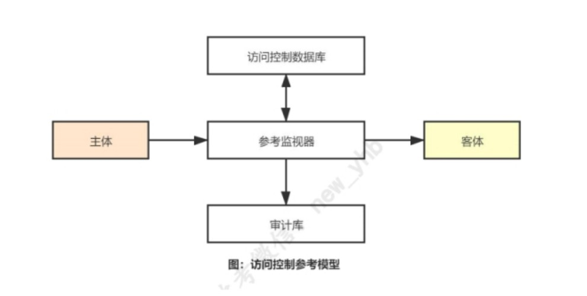

# 网络信息安全基础知识和技术(上午)

## 第1章 网络信息安全概述

### 网络安全基本属性  

口诀：**用奶控鸡丸**

机密性(confidentiality)、完整性(integrality)、可用性(applicability)、抗抵赖性、可控性

前三项简称为：CIA

### 法律  


《中华人民共和国网络安全法》 于 2017 年 6 月 1 日起实施
《中华人民共和国密码法》 于 2020 年 1 月 1 日起实施

* 技术措施  

口诀：**监测状态事件日志6个月**

**采取监测、记录网络运行状态、网络安全事件**的技术措施，并按照规定
**留存相关的网络日志不少于六个月**。

* 网安等级保护工作  

网络安全等级保护的主要工作可以概括为**定级、备案、建设整改、等级测评、运营维护**。


### 部门

国家计算机网络应急技术处理协调中心(CNCERT) -- 国家级应急中心

* 职责  

**积极预防、及时发现、快速响应、力保恢复**


## 第2章 网络攻击原理与常用方法

### 网络攻击一般过程

|             一般过程      |       内容            | 
| ------------------------- | -------------------- | 
| 隐藏攻击源                     | 隐藏黑客主机位置使得系统管理无法追踪                | 
| 收集攻击目标信息                    | 确定攻击目标并收集目标系统的有关信息                | 
| 挖掘漏洞信息                        | 从收集的目标信息中提取可使用的漏洞信息                  | 
| 获取目标访问权限               | 获取目标系统的普通或特权账户的权限           | 
| 隐蔽攻击行为                  | 隐蔽在目标系统中的操作，防止入侵行为被发现               | 
| 实施攻击                 | 进行破坏活动或者以目标系统为跳板向其他系统发起新的攻击 | 
| 开辟后门                     | 在目标系统中开辟后门，以便以后入侵    | 
| 清除攻击痕迹                  | 避免安全管理员的发现、追踪以及法律部门的取证    | 


## 第3章 密码学基本理论

### 密码学

密码学是一门研究信息安全保护的科学，以实现信息的**保密性、完整性、可用性和抗抵赖性**

### 代号缩写

明文（M）、密文（C）、
加密（E）、解密（D）、
加密密钥（Ke）、解密密钥（Kd）

### 密码分析攻击类型

|             密码分析攻击类型      |       内容            | 
| ------------------------- | -------------------- | 
| 唯密文攻击                     | 密码分析者只拥有一个或多个用同一个密钥加密的密文，没有其他可利用的信息                | 
| 已知明文攻击                    | 密码分析者仅知道当前密钥下的一些明文及所对应的密文                | 
| 选择明文攻击                       | 密码分析者能够得到当前密钥下自己选定的明文所对应的密文                  | 
| 密文验证攻击               | 密码分析者对于任何选定的密文，能够得到该密文"是否合法"的判断           | 
| 选择密文攻击                  | 除了挑战密文外，密码分析者能够得到任何选定的密文所对应的明文               | 


选择明文攻击：选择明文得到密文；  
选择密文攻击：选择密文得到明文  


### 国产商用密码算法

SM1 ——  对称加密算法  
SM2 ——  椭圆曲线数字签名算法  
SM3 ——  杂凑算法 消息分组长度为512位，输出256  
SM4 ——  对称加密算法 无线局域网产品使用  
SM9 ——  标识数字签名算法  

**SM2 椭圆曲线数字签名算法** 和 **SM9 标识数字签名算法**是我国国家密码管理局发布的**数字签名标准**。

**2006年**我国政府公布了自己的**商用密码算法**，成为我国密码发展史上的一件大事。

* PGP  

PGP用来保护邮件，密钥管理算法选用了IDEA


## 第4章 网络安全体系和网络安全模型

### 网络安全等级保护工作

主要包括 **定级、备案、建设整改、等级测评、监督检查** 五个阶段。

### 安全保护五个等级

口诀：**用桶记狗证**

第一级（用户自主保护级）  
第二级（系统审计保护级）  
第三级（安全标记保护级）  
第四级（结构化保护级）  
第五级（访问验证保护级）  

### 智慧城市安全技术保障功能要素

智慧城市安全技术保障的功能要素包括**防护、检测、响应和恢复**

### ISO27000 信息安全管理体系

信息安全管理系统（ISMS）按照 PDCA 不断循环改进。

1. 计划（Plan）:建立 ISMS，识别信息资产及其相关的安全需求;评估信息安全风险;选择合适的安全控制措施，管理不可接受的风险。
2. 执行（Do）:实现和运行 ISMS，实施控制和运维管理。
3. 检查（Check）:监测和评估 ISMS。
4. 处理（Act）:维持和改进 ISMS。

## 第5章 物理与环境安全技术

### 物理安全规范-信息系统物理安全分级

第一级物理安全平台为第一级 **用户自主保护级** 提供基本的物理安全保护。  
第二级物理安全平台为第二级 **系统审计保护级** 提供适当的物理安全保护。  
第三级物理安全平台为第三级 **安全标记保护级** 提供较高程度的物理安全保护。  
第四级物理安全平台为第四级 **结构化保护级** 提供更高程度的物理安全保护。  

PS: **与安全保护五个等级比较，少了最后一个 访问验证保护级**，其他相同。


## 第6章 认证技术原理与应用

### 认证机制 

**认证机制**是网络安全的基础性保护措施，是**实施访问控制的前提**  

认证一般由**标识（Identification）和鉴别（Authentication）两部分**组成

### 常见的四类认证依据


|             认证依据      |       概念            | 应用       | 
| ------------------------- | -------------------- | -------------- |
| 所知道的**秘密信息**              | 实体(声称者)所掌握的秘密信息           | 如用户口令、验证码等        |    
| 所拥有的**实物凭证**         | 实体(声称者)所持有的不可伪造的物理设备        | 如智能卡、U盾等  | 
| 所具有的**生物特征**                       | 实体(声称者)所具有的生物特征                  | 如指纹、声音、虹膜、人脸等           |
| 所表现的**行为特征**                | 实体(声称者)所表现的行为特征           | 如鼠标使用习惯、键盘敲键力度、地理位置等          | 


### Kerberos协议

* 简介  

Kerberos 网络认证协议，使用**对称密码提供认证服务**

### PKI 公钥基础设施(必背)  

* 定义(Public Key Infrastructure)  

指有关**创建、管理、分发和撤销**公钥证书所需要的**硬件、软件、人员、策略和过程**的安全服务设施。

PKI提供了一种**系统化的、可扩展的、统一的、容易控制的公钥分发方法**。


* 5大实体部分  

1. CA（Certification Authority）：**证书授权机构**，主要进行证书的**颁发、废止和更新**（可信第三方机构）；
2. RA （Registration Authority）：**证书登记权威机构**，将公钥和对应的证书持有者的身份及其他属性联系起来，进行注册和担保；
可以充当 CA 和 它的终端用户之间的中间实体，辅助 CA 完成其他绝大部分的证书处理功能。
3. 客户端：**使用者、进程服务等**(证书用户)。
4. 终端实体：**需要认证的对象**，例如服务器、打印机、用户等(证书持有者)。
5. 目录服务器：CA通常使用一个目录服务器提供**证书管理和分发的服务**(密钥存储库)。

### 其他认证

* 单点登录（Single Sign On）  

是指用户访问使用不同的系统时，只需要进行**一次身份认证**，就可以根据这次登录的认证身份**访问授权资源**。


* 快速在线认证  

FIDO

* 路由器认证  

OSPF、RIP 和 EIGRP

* 公民网络电子身份标识(eID)  

是国家网络安全的重要保障  

与个人真实身份具有一一对应关系，用于**在线识别公民真实身份的网络电子身份**。  

由**一对非对称密钥**和含有其**公钥及相关信息的数字证书**组成。

## 第7章 访问控制技术原理与应用

### 访问控制参考模型

口诀：**主靠客审问**

组成要素主要有主体（Subject）、参考监视器（Reference Monitor）、 客体（Object）、访问控制数据库 和 审计库



* 主体  
是客体的操作实施者。实体通常是**人、进程或设备**等，一般是代表用户执行操作的进程。  
比如编辑一个文件，编辑进程是存取文件的主体，而文件则是客体。

* 客体  

**是被主体操作的对象**。通常来说，对一个客体的访问隐含着对其信息的访问。

* 参考监视器  

**是访问控制的决策单元和执行单元的集合体**。控制从主体到客体的每一次
操作，监督主体和客体之间的授权访问行为，并将重要的安全事件存入审计文件
之中。

* 访问控制数据库  

**记录主体访问客体的权限及其访问方式的信息，提供访问控制决策判断的依据，也称为访问控制策略库**。
该数据库随着主体和客体的产生、删除及其权限的修改而动态变化。

* 审计库  

**存储主体访问客体的操作信息**，包括访问成功、访问失败以及访问操作信息。

### 自主访问控制

* 定义  

自主访问控制（Discretionary Access Control，DAC）是指**客体的所有者按照自己的安全策略授予系统中的其他用户对其的访问权**

* 两大类实现方法  

即**基于行**的自主访问控制和**基于列**的自主访问控制

> 基于行的自主访问控制  

口诀：行能口签

三种形式明细表： **能力表、前缀表、口令**

> 基于列的自主访问控制  

口诀：列互控

两种形式明细表：**保护位、访问控制表**

### 强制访问控制

* 定义  
是指系统根据主体和客体的安全属性，以强制方式控制主体对客体的访问。

与自主访问控制相比较，强制访问控制更加严格。用户使用**自主访问控制**虽
然能够防止其他用户非法入侵自己的网络资源，但**对于用户的意外事件或误
操作则无效**。

因此，自主访问控制不能适应高安全等级需求。**在政府部门、军事和金融等领域，
常利用强制访问控制机制**，将系统中的资源划分安全等级和不同类别，然后进行安全管理


### 基于角色的访问控制

所谓基于角色的访问控制（RBAC）就是指**根据完成某些职责任务所需要的访问权限来进行授权和管理**。

### 访问控制策略设计与实现(P147)

* 访问控制策略  

访问控制策略用于规定用户访问资源的权限，防止资源损失、泄密或非法使用.

* 访问控制规则类型  

1. 基于**用户身份**的访问控制规则
2. 基于**角色**的访问控制规则 
3. 基于**地址**的访问控制规则 
4. 基于**时间**的访问控制规则 
5. 基于**异常事件**的访问控制规则 
6. 基于**服务数量**的访问控制规则

* 用户管理  

口诀：**用户记分录册销户**

用户管理是网络安全管理的重要内容之一，其主要工作包括**用户登记、用户权限分配、访问记录、权限监测、权限取消、撤销用户**。

* 口令选择  

口令选择应至少在 8 个字符以上，应选用大小写字母、数字、特殊字符组合禁止使用与账号相同的口令。

### 访问控制技术应用

* UNIX\Linux系统  

普通的 UNIX、Linux 等系统中，实现自主访问控制技术的基本方法是在每个
文件上使用"9 比特位模式"来标识访问控制权限信息，这些二进制位标识了"**文
件的拥有者、与文件拥有者同组的用户、其他用户**"对文件所具有的访问权限和
方式。


* Windows 访问控制应用  

Windows 用户登录到系统时，WinLogon 进程为 用
户创建访问令牌，**包含用户及所属组的安全标识符（SID）**，作为用户的身份
标识。文件等客体则含有自主访问控制列表（DACL），标明谁有权访问，还含
有系统访问控制列表（SACL）。

### web服务访问控制应用

以Apache httpd的服务器为例，假设要保护/secret目录资源，
只有特点IP地址、IP子网或域名可以访问，则需要在access.conf中加入一个类似下面的目录控制段。

```conf


<Directory /full/path/to/secret>
<Limit GET POST>
deny from all
allow from x.y.z XXX.XXX.XXX.cn
allow a.b.c.d
</Limit>
</Directory>


```


## 第8章 防火墙技术原理与应用

### 防火墙类型与实现技术

* 分类  

基于防火墙**产品形态分类**：软件防火墙、硬件防火墙

基于防火墙**应用领域分类**：网络防火墙、Web防火墙、工控防火墙

* 防火墙的实现技术  

口诀：**过态应换分包**

包过滤、
状态检测、
应用服务代理、
网络地址转换、
协议分析、
深度包检查等

* 考纲  

防火墙的实现技术：
包过滤技术
应用服务代理技术
网络地址转换技术
WEB防火墙技术
数据库防火墙技术
工控防火墙技术
下一代防火墙技术

* iptables配置  

```shell


# 删除所有规则
iptables ‐F

# 设置默认规则，全禁止
## 所有未显式允许的流量将被丢弃，包括SSH等远程管理服务
iptables ‐P INPUT DROP
iptables ‐P OUTPUT DROP
iptables ‐P FORWARD DROP


```


## 第9章 VPN技术原理与应用

### VPN概念
VPN（Virtual Private Network），中文翻译为"虚拟专用网"，其基本技术
原理是**把需要经过公共网传递的报文（packet）加密处理后，再由公共网络发送到目的地**。  
利用 VPN 技术能够在不可信任的公共网络上构建一条专用的安全通道，经过VPN 传输的数据在公共网上具有保密性。
所谓"虚拟"指网络连接特性是逻辑的而不是物理。  
VPN 是通过**密码算法、标识鉴别、安全协议等相关的技术**，在公共的物理网络上通过逻辑方式构造出来的安全网络。

### VPN安全服务功能

VPN的主要安全服务有以下三种

1. **保密性**服务：防止传输的信息被监听
2. **完整性**服务
3. **认证服务**：提供用户和设备的访问认证，防止非法接入

### VPN类型和实现技术

* VPN类型  

链路层VPN、网络层VPN、传输层VPN等

* VPN实现技术  

密码算法、秘钥管理、认证访问控制、IPSec协议(网络层)、SSL协议(传输层)等（等：PPTP、L2TP）

### VPN主要技术指标与产品

* 主要产品特征  

IPSec VPN：IPS工作模式应支持**隧道模式和传输模式**  
隧道模式适用于主机和网关实现  
传输模式是可选功能，仅适用于主机实现。  

SSL VPN: 工作模式分为**客户端-服务端模式、网关-网关模式**两种。


* 功能技术指标  

IPSec VPN 的主要功能包括：随机数生成、密钥协商、**安全报文封装**、身份鉴别、NAT 穿越。  
身份认证数据应支持数字证书或公私密钥对方式，IP 协议版本应支持 IPv4 协议或IPv6 协议。

SSL VPN 的主要功能包括：随机数生成、密钥协商、**安全报文传输**、身份鉴别、访问控制、密钥更新、客户端主机安全检查。

* 性能技术指标  
  
IPSec VPN 主要性能指标如下：**加解密吞吐率、加解密时延、加解密丢包率、每秒新建连接数**

SSL VPN 主要性能指标如下：**最大并发用户数、最大并发连接数、每秒新建连接数、吞吐率**


### VPN技术应用

根据 VPN 的用途，VPN 可分为三种应用类型：

远程访问虚拟网（Access VPN）、
企业内部虚拟网（Intranet VPN）、
企业扩展虚拟网（ExtranetVPN）。

* 远程安全访问（远程访问虚拟网 Access VPN）  
  
远程安全访问:Access VPN 主要解决远程用户安全办公问题，远程办公用户既要能远
程获取到企业内部网信息，又要能够保证用户和企业内网的安全。远程用户利用VPN
技术，通过拨号、ISDN 等方式接入公司内部网。

AccesVPN 一般包含两部分，**远程用户 VPN 客户端软件和 VPN 接入设备**。

* 构建内部安全专网（企业内部虚拟网 Intranet VPN）  

随着业务的发展变化，企业办公不再集中在一个地点，而是分布在各个不同的地理区域，甚至是跨越不同的国家。
因而，企业的信息环境也随之变化。针对企业的这种情况，Intranet VPN 的用途就是通过公用网络，如因特网，
**把分散在不同地理区域的企业办公点的局域网安全互联起来**，实现企业内部信息的安全共享和企业办公自动化。

* 外部网络安全互联 （企业扩展虚拟网 Extranet VPN）  

由于企业合作伙伴的主机和网络分布在不同的地理位置，传统上一般通过专线互连实
现信息交换，但是网络建设与管理维护都非常困难，造成企业间的商业
交易程序复杂化。Extranet VPN 则是利用 VPN 技术，**在公共通信基础设施（如因特网）上把合作伙伴的网络或主机安全接到企业内部网，以方便企业与合作伙伴共享信息和服务**。
Extranet VPN 解决了企业外部机构接入安全和通信安全的问题，同时也降低了网络建设成本。


## 第10章 入侵检测技术原理与应用

### 入侵检测

* 入侵检测概念  

入侵检测通过**收集操作系统、系统程序、应用程序、网络包等信息**，发现系统中**违背安全策略或危及系统安全的行为**。

* 入侵检测模型  

CIDF:该模型认为入侵检测系统由以下四部分组成：**事件产生器、事件分析器、响应单元和事件数据库**
（CIDF将需要分析的数据统称为事件；事件产生器从整个计算环境中获得事件）

* 入侵检测作用（就是发现入侵行为）  

1.发现受保护系统中的入侵行为或异常行为
2.检验安全保护措施的有效性
3.分析受保护系统所面临的威胁
4.有利于阻止安全事件扩大，及时报警触发网络安全应急响应
5.可以为网络安全策略的制定提供重要指导
6.报警信息可用作网络犯罪取证


### 入侵检测技术

1. 基于**误用**的入侵检测技术  
2. 基于**异常**的入侵检测技术 
3. 基于**规范**的检测方法 
4. 基于**生物免疫**的检测方法 
5. 基于**攻击诱骗**的检测方法 
6. 基于**入侵报警**的关联检测方法  

* 基于误用的入侵检测技术   

基于特征检测,依赖于攻击模式库。

* 基于异常的入侵检测技术  

  将系统运行的数值与“正常轨迹”比较。（例如CPU、内存使用率）

* 基于规范的检测方法  

  介于误用检测和异常检测之间，若特权程序的操作序列不符合已定义的
  操作序列，就进行入侵检测报警。能够发现已知和未知的攻击。

* 基于生物免疫的检测方法  

综合误用与异常两种检测方法，构造系统“自我”标志，识别“非自我”的入侵行为。

* 基于攻击诱骗的检测方法  

类似于蜜罐

* 基于入侵报警的关联检测方法  

（其实就是多加了一个关联性分析）
对原始IDS报警事件的分类及相关性分析来发现复杂攻击行为

### 入侵检测系统组成与分类

* 入侵检测系统组成  

1. 数据采集模块 
2. 入侵分析引擎模块
3. 应急处理模块
4. 管理配置模块
5. 相关辅助模块

* 基于主机的入侵检测系统 HIDS (Host-based Intrusion Detection System)  

相关软件：SWATCH、Tripwire、网页防篡改系统

* 基于网络的入侵检测系统 NIDS(Network Intrusion detection system)  

* 分布式入侵检测系统  
  
它可以跨越多个子网检测攻击行为，特别是大型网络。
可以解决以下问题：
  1. 系统漏洞分散在网络中的各个主机上
  2. 入侵行为不再单一，而是相互协作
  3. 网络传输速度加快，流量增大

### 入侵检测系统主要技术指标与产品

* 入侵检测主要技术指标  

1. 功能技术指标
2. 性能技术指标
3. 安全技术指标

入侵检测系统的主要指标有**可靠性、可用性、可扩展性、时效性、准确性和安全性**。

* 入侵检测产品工作机制分析、入侵检测产品标准理解、入侵检测产品适用场景等  

常见入侵检测相关产品有以下几类：

1. 主机入侵检测系统
2. 网络入侵检测系统
3. 统一威胁管理
4. 高级持续威胁检测系统


* 入侵检测产品适用场景  

1. 上网保护
2. 网站入侵检测与保护 
3. 网络攻击阻断 
4. 主机/终端恶意代码检测 
5. 网络安全监测预警与应急处置 
6. 网络安全等级保护

* 入侵检测系统应用(Intrusion Detection System)  

(感觉10.5 10.4这两节没啥内容，比较乱)  

1. 入侵检测系统部署方法与步骤
2. 主机入侵检测 （H IDS）
3. 网络系统内部入侵检测 (N IDS)
4. 网络系统外部入侵检测 (N IDS)

## 第11章 网络物理隔离技术原理与应用

### 网络物理隔离概述

* 网络物理隔离概念  

既能满足内外网信息及数据交换需求，又能防止网络安全事件出现。

* 网络物理隔离工作原理  

避免两台计算机之间直接的信息交换以及物理上的连通，以阻断两台计算机之间的直接在线网络攻击。

### 网络物理隔离系统与类型

* 网络物理隔离系统组成  

按照隔离的对象：分为单点隔离系统 和 区域隔离系统。

按照信息传递方向：分为双向物理隔离系统、单向网络隔离系统。

* 终端物理隔离系统  


### 网络物理隔离机制与实现技术

* 专用计算机
* 多PC
* 外网代理服务
* 内外网线路切换器
* 单硬盘内外分区
* 双硬盘
* 网闸
* 协议隔离技术
* 单向传输部件
* 信息摆渡技术
* 物理断开技术

### 网络物理隔离主要技术指标与产品

#### 入侵检测主要技术指标  

* 功能技术指标  

|  产品名称   | 功能要求  |
|  ----  | ----  |
| 终端隔离产品  | 访问控制、不可旁路和客体重用 |
| 网络隔离产品  | 访问控制、抗攻击、安全管理、标识和鉴别、审计、域隔离、容错、数据完整性和密码支持 |
| 网络单向导入  | 访问控制、抗攻击、安全管理、标识和鉴别、审计、域隔离、配置数据保护和运行状态监测 |


* 性能技术指标  

对网络和终端隔离产品应达到的性能指标作出规定，包括**交换速率和硬件切换时间**。

* 安全技术指标  

关于产品的质量和服务器保障要求，入配置管理、交付和运行、开发和指导性文档、测试、脆弱性评定等。


#### 网络物理隔离产品(P222) 

* 终端隔离产品  

采用**物理断开**技术,连接两个不同的安全域。

* 网络隔离产品  

实现安全域之间的应用代理服务、协议转换、信息流访问控制、内容过滤和信息摆渡等功能。

* 网络单向导入产品  

两个安全域之间信息单向导入


### 网络物理隔离应用

* 内网用户安全访问互联网  

* 业务生产网与互联网隔离  

* 内外网安全物理隔离  

* 不同安全区域信息交换  


## 第12章 网络安全审计技术原理与应用

### 网络安全审计概述

* 网络安全审计概念  

网络安全审计是指对网络信息系统的安全相关活动信息进行获取、记录、存储、分析和利用的工作。

* 网络安全审计用途  

网络安全审计的作用在于建立"事后"安全保障措施，保存网络安全事件及行为信息，为网络安全事件分析**提供线索及证据**，以便于**发现**潜在的网络安全威胁行为，开展网络安全风险**分析及管理**。

### 网络安全审计系统组成与类型

* 网络安全审计系统组成  

网络安全审计系统一般包括**审计信息获取、审计信息存储、审计信息分析、审计信息展示及利用、系统管理**等组成部分。

* 网络安全审计系统运行机制  

* 网络安全审计系统类型(重点)  

**网络通信**安全审计  
**操作系统**安全审计  
**数据库** 安全审计  
**应用系统**安全审计  
**运维** 安全审计  


### 网络安全审计机制与实现技术

* 网络流量数据采集技术  

交换机端口、镜像、网络嗅探等  
libcap、winpcap、tcpdump、wireshark

* 系统日志数据采集技术  

syslog、FTP、snmp

* Tcpdump的使用  

* 网络审计数据分析技术  

1. 字符串匹配
2. 全文搜索
3. 数据关联
4. 统计报表
5. 可视化分析

* 网络审计数据保护技术

1. 系统用户分区管理
2. 审计数据**强制访问**
3. 审计数据**加密**
4. 审计数据**隐私保护**
5. 审计数据**完整性保护**
6. 审计数据**备份**

* 网络安全审计应用  

1. 网络合规使用
2. 网络电子取证
3. 网络安全运维保障

## 第13章 网络安全漏洞防护技术原理与应用

### 概述

* 网络安全漏洞概念  

网络安全漏洞又称为脆弱性，简称漏洞。漏洞一般是致使网络信息安全策略相冲突的缺陷，这种缺陷通常称为安全隐患。

* 网络安全漏洞危害  

**敏感信息泄露**  
**非授权访问**  
**身份假冒**  
**拒绝服务**  
普通用户权限提升  
获取远程管理员权限  
服务器信息泄露  
读取受限文件  
口令恢复  
欺骗  

* 国家信息安全漏洞库(CNNVD)  

* 国家信息安全漏洞共享平台(CNVD)  

* 标准规范  

  《信息安全技术 安全漏洞分类（GB/T 33561-2017）》  
  《信息安全技术 安全漏洞等级划分指南（GM/T 30279-2013）》  
  《信息安全技术 安全漏洞标识与描述规范（GM/T 28458-2012）》  
  《信息安全技术 信息安全漏洞管理规范（GB/T 30276-2013）》 

### 网络安全漏洞分类与管理

* 网络安全漏洞来源  

>  非技术性安全漏洞  

1. 网络安全责任主体不明确
2. 网络安全策略不完备
3. 网络安全操作技能不足
4. 网络安全监督缺失
5. 网络安全特区控制不完备

>  技术性安全漏洞  

1. 设计错误
2. 输入验证错误
3. 缓冲区溢出
4. 意外情况处置错误
5. 访问验证错误
6. 配置错误
7. 竞争条件
8. 环境错误


* 网络安全漏洞命名规范  

CVE、CNNVD、CNVD


* 网络安全漏洞分类分级  

1. CVSS 通用漏洞计分系统
2. CNNVD漏洞分类
3. CNVD 漏洞分类
4. OWASP TOP 10 Web应用漏洞

* 网络安全漏洞发布  

漏洞发布方式： 网站、电子邮件、安全论坛  

漏洞信息公布内容： 漏洞编号、发布日期、安全危害级别、发布日期、安全危害级别、漏洞名称、漏洞影响平台。

* 网络安全漏洞获取  

来源：
1. 网络安全应急响应机构
2. 网络安全厂商
3. IT产品或系统提供商
4. 网络安全组织

* 网络安全漏洞信息来源  

国家信息安全漏洞库CNNVD  
国家信息安全漏洞共享平台CNVD  
Bugtra漏洞库  
CERT  
Security Focus Vulnerability Database  
厂商漏洞信息  

* 网络安全漏洞管理过程  

1. 网络信息资产确认
2. 网络安全漏洞采集
3. 网络安全漏洞评估
4. 网络安全漏洞消除和控制
5. 网络安全漏洞变化跟踪