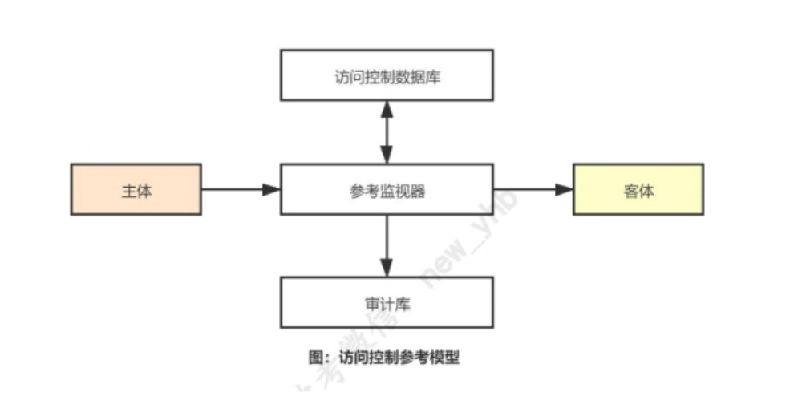

# 网络信息安全基础知识和技术(上午)

## 第1章 网络信息安全概述

### 网络安全基本属性  

口诀：**用奶控鸡丸** 或 **用奶控整鸡**

机密性(confidentiality)、完整性(integrality)、可用性(applicability)、抗抵赖性、可控性

前三项简称为：CIA

抵赖是指：**事后否认某些网络行为**

### 法律  


《中华人民共和国网络安全法》 于 2017 年 6 月 1 日起实施(国务院决定或者批准，管理归属网信部门)
《中华人民共和国密码法》 于 2020 年 1 月 1 日起实施
《中华人民共和国数据安全法》于 2021 年 9 月 1 日起实施

* 技术措施  

口诀：**监测状态事件日志6个月**

**采取监测、记录网络运行状态、网络安全事件**的技术措施，并按照规定
**留存相关的网络日志不少于六个月**。

* 网安等级保护工作  

网络安全等级保护的主要工作可以概括为**定级、备案、建设整改、等级测评、运营维护**。


### 部门

国家计算机网络应急技术处理协调中心(CNCERT) -- 国家级应急中心

* 职责  

**积极预防、及时发现、快速响应、力保恢复**


## 第2章 网络攻击原理与常用方法

### 网络攻击一般过程

|             一般过程      |       内容            | 
| ------------------------- | -------------------- | 
| 隐藏攻击源                     | 隐藏黑客主机位置使得系统管理无法追踪                | 
| 收集攻击目标信息                    | 确定攻击目标并收集目标系统的有关信息                | 
| 挖掘漏洞信息                        | 从收集的目标信息中提取可使用的漏洞信息                  | 
| 获取目标访问权限               | 获取目标系统的普通或特权账户的权限           | 
| 隐蔽攻击行为                  | 隐蔽在目标系统中的操作，防止入侵行为被发现               | 
| 实施攻击                 | 进行破坏活动或者以目标系统为跳板向其他系统发起新的攻击 | 
| 开辟后门                     | 在目标系统中开辟后门，以便以后入侵    | 
| 清除攻击痕迹                  | 避免安全管理员的发现、追踪以及法律部门的取证    | 


## 第3章 密码学基本理论

### 密码学

密码学是一门研究信息安全保护的科学，以实现信息的**保密性、完整性、可用性和抗抵赖性**


### 代号缩写

明文（M）、密文（C）、
加密（E）、解密（D）、
加密密钥（Ke）、解密密钥（Kd）

### 密码分析攻击类型

|             密码分析攻击类型      |       内容            | 
| ------------------------- | -------------------- | 
| 唯密文攻击                     | 密码分析者只拥有一个或多个用同一个密钥加密的密文，没有其他可利用的信息                | 
| 已知明文攻击                    | 密码分析者仅知道当前密钥下的一些明文及所对应的密文                | 
| 选择明文攻击                       | 密码分析者能够得到当前密钥下自己选定的明文所对应的密文                  | 
| 密文验证攻击               | 密码分析者对于任何选定的密文，能够得到该密文"是否合法"的判断           | 
| 选择密文攻击                  | 除了挑战密文外，密码分析者能够得到任何选定的密文所对应的明文               | 


选择明文攻击：选择明文得到密文；  
选择密文攻击：选择密文得到明文  


### 国产商用密码算法

SM1 ——  对称加密算法  
SM2 ——  椭圆曲线数字签名算法  
SM3 ——  杂凑算法 (采用 Merkle-Damgard结构，消息分组长度为512位，摘要长度256b) 
SM4 ——  对称加密算法 (分组长度和密钥长度分别为128位和128位) 无线局域网产品使用  
SM9 ——  标识数字签名算法  

**SM2 椭圆曲线数字签名算法** 和 **SM9 标识数字签名算法**是我国国家密码管理局发布的**数字签名标准**。

**2006年**我国政府公布了自己的**商用密码算法**，成为我国密码发展史上的一件大事。

* PGP  

PGP用来保护邮件，密钥管理算法选用了IDEA


## 第4章 网络安全体系和网络安全模型

### 网络安全等级保护工作

主要包括 **定级、备案、建设整改、等级测评、监督检查** 五个阶段。

### 安全保护五个等级

口诀：**用桶记狗证**

第一级（用户自主保护级）  
第二级（系统审计保护级）  
第三级（安全标记保护级）  
第四级（结构化保护级）  
第五级（访问验证保护级） ：提供系统恢复机制


### 智慧城市安全技术保障功能要素

智慧城市安全技术保障的功能要素包括**防护、检测、响应和恢复**

### ISO27000 信息安全管理体系

信息安全管理系统（ISMS）按照 PDCA 不断循环改进。

1. 计划（Plan）:建立 ISMS，识别信息资产及其相关的安全需求;评估信息安全风险;选择合适的安全控制措施，管理不可接受的风险。
2. 执行（Do）:实现和运行 ISMS，实施控制和运维管理。
3. 检查（Check）:监测和评估 ISMS。
4. 处理（Act）:维持和改进 ISMS。

## 第5章 物理与环境安全技术

### 物理安全规范-信息系统物理安全分级

第一级物理安全平台为第一级 **用户自主保护级** 提供基本的物理安全保护。  
第二级物理安全平台为第二级 **系统审计保护级** 提供适当的物理安全保护。  
第三级物理安全平台为第三级 **安全标记保护级** 提供较高程度的物理安全保护。  
第四级物理安全平台为第四级 **结构化保护级** 提供更高程度的物理安全保护。  

PS: **与安全保护五个等级比较，少了最后一个 访问验证保护级**，其他相同。


## 第6章 认证技术原理与应用

### 认证机制 

**认证机制**是网络安全的基础性保护措施，是**实施访问控制的前提**  

认证一般由**标识（Identification）和鉴别（Authentication）两部分**组成

### 常见的四类认证依据


|             认证依据      |       概念            | 应用       | 
| ------------------------- | -------------------- | -------------- |
| 所知道的**秘密信息**              | 实体(声称者)所掌握的秘密信息           | 如用户口令、验证码等        |    
| 所拥有的**实物凭证**         | 实体(声称者)所持有的不可伪造的物理设备        | 如智能卡、U盾等  | 
| 所具有的**生物特征**                       | 实体(声称者)所具有的生物特征                  | 如指纹、声音、虹膜、人脸等           |
| 所表现的**行为特征**                | 实体(声称者)所表现的行为特征           | 如鼠标使用习惯、键盘敲键力度、地理位置等          | 


### Kerberos协议

* 简介  

Kerberos 网络认证协议，使用**对称密码提供认证服务**

### PKI 公钥基础设施(必背)  

* 定义(Public Key Infrastructure)  

指有关**创建、管理、分发和撤销**公钥证书所需要的**硬件、软件、人员、策略和过程**的安全服务设施。

PKI提供了一种**系统化的、可扩展的、统一的、容易控制的公钥分发方法**。


* 5大实体部分  

1. CA（Certification Authority）：**证书授权机构**，主要进行证书的**颁发、废止和更新**（可信第三方机构）；
2. RA （Registration Authority）：**证书登记权威机构**，将公钥和对应的证书持有者的身份及其他属性联系起来，进行注册和担保；
可以充当 CA 和 它的终端用户之间的中间实体，辅助 CA 完成其他绝大部分的证书处理功能。
3. 客户端：**使用者、进程服务等**(证书用户)。
4. 终端实体：**需要认证的对象**，例如服务器、打印机、用户等(证书持有者)。
5. 目录服务器：CA通常使用一个目录服务器提供**证书管理和分发的服务**(密钥存储库)。

### 其他认证

* 单点登录（Single Sign On）  

是指用户访问使用不同的系统时，只需要进行**一次身份认证**，就可以根据这次登录的认证身份**访问授权资源**。


* 快速在线认证  

FIDO

* 路由器认证  

OSPF、RIP 和 EIGRP

* 公民网络电子身份标识(eID)  

是国家网络安全的重要保障  

与个人真实身份具有一一对应关系，用于**在线识别公民真实身份的网络电子身份**。  

由**一对非对称密钥**和含有其**公钥及相关信息的数字证书**组成。

## 第7章 访问控制技术原理与应用

### 访问控制参考模型

口诀：**主靠客审问**

组成要素主要有主体（Subject）、参考监视器（Reference Monitor）、 客体（Object）、访问控制数据库 和 审计库



* 主体  
是客体的操作实施者。实体通常是**人、进程或设备**等，一般是代表用户执行操作的进程。  
比如编辑一个文件，编辑进程是存取文件的主体，而文件则是客体。

* 客体  

**是被主体操作的对象**。通常来说，对一个客体的访问隐含着对其信息的访问。

* 参考监视器  

**是访问控制的决策单元和执行单元的集合体**。控制从主体到客体的每一次
操作，监督主体和客体之间的授权访问行为，并将重要的安全事件存入审计文件
之中。

* 访问控制数据库  

**记录主体访问客体的权限及其访问方式的信息，提供访问控制决策判断的依据，也称为访问控制策略库**。
该数据库随着主体和客体的产生、删除及其权限的修改而动态变化。

* 审计库  

**存储主体访问客体的操作信息**，包括访问成功、访问失败以及访问操作信息。

### 自主访问控制

* 定义  

自主访问控制（Discretionary Access Control，DAC）是指**客体的所有者按照自己的安全策略授予系统中的其他用户对其的访问权**

* 两大类实现方法  

即**基于行**的自主访问控制和**基于列**的自主访问控制

> 基于行的自主访问控制  

口诀：行能口签

三种形式明细表： **能力表、前缀表、口令**

> 基于列的自主访问控制  

口诀：列互控

两种形式明细表：**保护位、访问控制表**

### 强制访问控制

* 定义  
是指系统根据主体和客体的安全属性，以强制方式控制主体对客体的访问。

与自主访问控制相比较，强制访问控制更加严格。用户使用**自主访问控制**虽
然能够防止其他用户非法入侵自己的网络资源，但**对于用户的意外事件或误
操作则无效**。

因此，自主访问控制不能适应高安全等级需求。**在政府部门、军事和金融等领域，
常利用强制访问控制机制**，将系统中的资源划分安全等级和不同类别，然后进行安全管理


### 基于角色的访问控制

所谓基于角色的访问控制（RBAC）就是指**根据完成某些职责任务所需要的访问权限来进行授权和管理**。

### 访问控制策略设计与实现(P147)

* 访问控制策略  

访问控制策略用于规定用户访问资源的权限，防止资源损失、泄密或非法使用.

* 访问控制规则类型  

1. 基于**用户身份**的访问控制规则
2. 基于**角色**的访问控制规则 
3. 基于**地址**的访问控制规则 
4. 基于**时间**的访问控制规则 
5. 基于**异常事件**的访问控制规则 
6. 基于**服务数量**的访问控制规则

* 用户管理  

口诀：**用户记分录册销户**

用户管理是网络安全管理的重要内容之一，其主要工作包括**用户登记、用户权限分配、访问记录、权限监测、权限取消、撤销用户**。

* 口令选择  

口令选择应至少在 8 个字符以上，应选用大小写字母、数字、特殊字符组合禁止使用与账号相同的口令。

### 访问控制技术应用

* UNIX\Linux系统  

普通的 UNIX、Linux 等系统中，实现自主访问控制技术的基本方法是在每个
文件上使用"9 比特位模式"来标识访问控制权限信息，这些二进制位标识了"**文
件的拥有者、与文件拥有者同组的用户、其他用户**"对文件所具有的访问权限和
方式。


* Windows 访问控制应用  

Windows 用户登录到系统时，WinLogon 进程为 用
户创建访问令牌，**包含用户及所属组的安全标识符（SID）**，作为用户的身份
标识。文件等客体则含有自主访问控制列表（DACL），标明谁有权访问，还含
有系统访问控制列表（SACL）。

### web服务访问控制应用

以Apache httpd的服务器为例，假设要保护/secret目录资源，
只有特点IP地址、IP子网或域名可以访问，则需要在access.conf中加入一个类似下面的目录控制段。

```conf


<Directory /full/path/to/secret>
<Limit GET POST>
deny from all
allow from x.y.z XXX.XXX.XXX.cn
allow a.b.c.d
</Limit>
</Directory>


```


## 第8章 防火墙技术原理与应用

### 防火墙类型与实现技术

* 分类  

基于防火墙**产品形态分类**：软件防火墙、硬件防火墙

基于防火墙**应用领域分类**：网络防火墙、Web防火墙、工控防火墙

* 防火墙的实现技术  

口诀：**过态应换分包**

包过滤、
状态检测、
应用服务代理、
网络地址转换、
协议分析、
深度包检查等

* 考纲  

防火墙的实现技术：
包过滤技术
应用服务代理技术
网络地址转换技术
WEB防火墙技术
数据库防火墙技术
工控防火墙技术
下一代防火墙技术

* iptables配置  

```shell


# 删除所有规则
iptables ‐F

# 设置默认规则，全禁止
## 所有未显式允许的流量将被丢弃，包括SSH等远程管理服务
iptables ‐P INPUT DROP
iptables ‐P OUTPUT DROP
iptables ‐P FORWARD DROP


```


## 第9章 VPN技术原理与应用

### VPN概念
VPN（Virtual Private Network），中文翻译为"虚拟专用网"，其基本技术
原理是**把需要经过公共网传递的报文（packet）加密处理后，再由公共网络发送到目的地**。  
利用 VPN 技术能够在不可信任的公共网络上构建一条专用的安全通道，经过VPN 传输的数据在公共网上具有保密性。
所谓"虚拟"指网络连接特性是逻辑的而不是物理。  
VPN 是通过**密码算法、标识鉴别、安全协议等相关的技术**，在公共的物理网络上通过逻辑方式构造出来的安全网络。

### VPN安全服务功能

VPN的主要安全服务有以下三种

1. **保密性**服务：防止传输的信息被监听
2. **完整性**服务
3. **认证服务**：提供用户和设备的访问认证，防止非法接入

### VPN类型和实现技术

* VPN类型  

链路层VPN、网络层VPN、传输层VPN等

* VPN实现技术  

密码算法、秘钥管理、认证访问控制、IPSec协议(网络层)、SSL协议(传输层)等（等：PPTP、L2TP）

### VPN主要技术指标与产品

* 主要产品特征  

IPSec VPN：IPS工作模式应支持**隧道模式和传输模式**  
隧道模式适用于主机和网关实现  
传输模式是可选功能，仅适用于主机实现。  

SSL VPN: 工作模式分为**客户端-服务端模式、网关-网关模式**两种。


* 功能技术指标  

IPSec VPN 的主要功能包括：随机数生成、密钥协商、**安全报文封装**、身份鉴别、NAT 穿越。  
身份认证数据应支持数字证书或公私密钥对方式，IP 协议版本应支持 IPv4 协议或IPv6 协议。

SSL VPN 的主要功能包括：随机数生成、密钥协商、**安全报文传输**、身份鉴别、访问控制、密钥更新、客户端主机安全检查。

* 性能技术指标  
  
IPSec VPN 主要性能指标如下：**加解密吞吐率、加解密时延、加解密丢包率、每秒新建连接数**

SSL VPN 主要性能指标如下：**最大并发用户数、最大并发连接数、每秒新建连接数、吞吐率**


### VPN技术应用

根据 VPN 的用途，VPN 可分为三种应用类型：

远程访问虚拟网（Access VPN）、
企业内部虚拟网（Intranet VPN）、
企业扩展虚拟网（ExtranetVPN）。

* 远程安全访问（远程访问虚拟网 Access VPN）  
  
远程安全访问:Access VPN 主要解决远程用户安全办公问题，远程办公用户既要能远
程获取到企业内部网信息，又要能够保证用户和企业内网的安全。远程用户利用VPN
技术，通过拨号、ISDN 等方式接入公司内部网。

AccesVPN 一般包含两部分，**远程用户 VPN 客户端软件和 VPN 接入设备**。

* 构建内部安全专网（企业内部虚拟网 Intranet VPN）  

随着业务的发展变化，企业办公不再集中在一个地点，而是分布在各个不同的地理区域，甚至是跨越不同的国家。
因而，企业的信息环境也随之变化。针对企业的这种情况，Intranet VPN 的用途就是通过公用网络，如因特网，
**把分散在不同地理区域的企业办公点的局域网安全互联起来**，实现企业内部信息的安全共享和企业办公自动化。

* 外部网络安全互联 （企业扩展虚拟网 Extranet VPN）  

由于企业合作伙伴的主机和网络分布在不同的地理位置，传统上一般通过专线互连实
现信息交换，但是网络建设与管理维护都非常困难，造成企业间的商业
交易程序复杂化。Extranet VPN 则是利用 VPN 技术，**在公共通信基础设施（如因特网）上把合作伙伴的网络或主机安全接到企业内部网，以方便企业与合作伙伴共享信息和服务**。
Extranet VPN 解决了企业外部机构接入安全和通信安全的问题，同时也降低了网络建设成本。


## 第10章 入侵检测技术原理与应用

### 入侵检测

* 入侵检测概念  

入侵检测通过**收集操作系统、系统程序、应用程序、网络包等信息**，发现系统中**违背安全策略或危及系统安全的行为**。

* 入侵检测模型  

CIDF:该模型认为入侵检测系统由以下四部分组成：**事件产生器、事件分析器、响应单元和事件数据库**
（CIDF将需要分析的数据统称为事件；事件产生器从整个计算环境中获得事件）

* 入侵检测作用（就是发现入侵行为）  

1.发现受保护系统中的入侵行为或异常行为
2.检验安全保护措施的有效性
3.分析受保护系统所面临的威胁
4.有利于阻止安全事件扩大，及时报警触发网络安全应急响应
5.可以为网络安全策略的制定提供重要指导
6.报警信息可用作网络犯罪取证


### 入侵检测技术

1. 基于**误用**的入侵检测技术  
2. 基于**异常**的入侵检测技术 
3. 基于**规范**的检测方法 
4. 基于**生物免疫**的检测方法 
5. 基于**攻击诱骗**的检测方法 
6. 基于**入侵报警**的关联检测方法  

* 基于误用的入侵检测技术   

基于特征检测,依赖于攻击模式库。

* 基于异常的入侵检测技术  

  将系统运行的数值与“正常轨迹”比较。（例如CPU、内存使用率）

* 基于规范的检测方法  

  介于误用检测和异常检测之间，若特权程序的操作序列不符合已定义的
  操作序列，就进行入侵检测报警。能够发现已知和未知的攻击。

* 基于生物免疫的检测方法  

综合误用与异常两种检测方法，构造系统“自我”标志，识别“非自我”的入侵行为。

* 基于攻击诱骗的检测方法  

类似于蜜罐

* 基于入侵报警的关联检测方法  

（其实就是多加了一个关联性分析）
对原始IDS报警事件的分类及相关性分析来发现复杂攻击行为

### 入侵检测系统组成与分类

* 入侵检测系统组成  

1. 数据采集模块 
2. 入侵分析引擎模块
3. 应急处理模块
4. 管理配置模块
5. 相关辅助模块

* 基于主机的入侵检测系统 HIDS (Host-based Intrusion Detection System)  

相关软件：SWATCH、Tripwire、网页防篡改系统

* 基于网络的入侵检测系统 NIDS(Network Intrusion detection system)  

* 分布式入侵检测系统  
  
它可以跨越多个子网检测攻击行为，特别是大型网络。
可以解决以下问题：
  1. 系统漏洞分散在网络中的各个主机上
  2. 入侵行为不再单一，而是相互协作
  3. 网络传输速度加快，流量增大

### 入侵检测系统主要技术指标与产品

* 入侵检测主要技术指标  

1. 功能技术指标
2. 性能技术指标
3. 安全技术指标

入侵检测系统的主要指标有**可靠性、可用性、可扩展性、时效性、准确性和安全性**。

* 入侵检测产品工作机制分析、入侵检测产品标准理解、入侵检测产品适用场景等  

常见入侵检测相关产品有以下几类：

1. 主机入侵检测系统
2. 网络入侵检测系统
3. 统一威胁管理
4. 高级持续威胁检测系统


* 入侵检测产品适用场景  

1. 上网保护
2. 网站入侵检测与保护 
3. 网络攻击阻断 
4. 主机/终端恶意代码检测 
5. 网络安全监测预警与应急处置 
6. 网络安全等级保护

* 入侵检测系统应用(Intrusion Detection System)  

(感觉10.5 10.4这两节没啥内容，比较乱)  

1. 入侵检测系统部署方法与步骤
2. 主机入侵检测 （H IDS）
3. 网络系统内部入侵检测 (N IDS)
4. 网络系统外部入侵检测 (N IDS)

## 第11章 网络物理隔离技术原理与应用

### 网络物理隔离概述

* 网络物理隔离概念  

既能满足内外网信息及数据交换需求，又能防止网络安全事件出现。

* 网络物理隔离工作原理  

避免两台计算机之间直接的信息交换以及物理上的连通，以阻断两台计算机之间的直接在线网络攻击。

### 网络物理隔离系统与类型

* 网络物理隔离系统组成  

按照隔离的对象：分为单点隔离系统 和 区域隔离系统。

按照信息传递方向：分为双向物理隔离系统、单向网络隔离系统。

* 终端物理隔离系统  


### 网络物理隔离机制与实现技术

* 专用计算机
* 多PC
* 外网代理服务
* 内外网线路切换器
* 单硬盘内外分区
* 双硬盘
* 网闸
* 协议隔离技术
* 单向传输部件
* 信息摆渡技术
* 物理断开技术

### 网络物理隔离主要技术指标与产品

#### 入侵检测主要技术指标  

* 功能技术指标  

|  产品名称   | 功能要求  |
|  ----  | ----  |
| 终端隔离产品  | 访问控制、不可旁路和客体重用 |
| 网络隔离产品  | 访问控制、抗攻击、安全管理、标识和鉴别、审计、域隔离、容错、数据完整性和密码支持 |
| 网络单向导入  | 访问控制、抗攻击、安全管理、标识和鉴别、审计、域隔离、配置数据保护和运行状态监测 |


* 性能技术指标  

对网络和终端隔离产品应达到的性能指标作出规定，包括**交换速率和硬件切换时间**。

* 安全技术指标  

关于产品的质量和服务器保障要求，入配置管理、交付和运行、开发和指导性文档、测试、脆弱性评定等。


#### 网络物理隔离产品(P222) 

* 终端隔离产品  

采用**物理断开**技术,连接两个不同的安全域。

* 网络隔离产品  

实现安全域之间的应用代理服务、协议转换、信息流访问控制、内容过滤和信息摆渡等功能。

* 网络单向导入产品  

两个安全域之间信息单向导入


### 网络物理隔离应用

* 内网用户安全访问互联网  

* 业务生产网与互联网隔离  

* 内外网安全物理隔离  

* 不同安全区域信息交换  


## 第12章 网络安全审计技术原理与应用

### 网络安全审计概述

* 网络安全审计概念  

网络安全审计是指对网络信息系统的安全相关活动信息进行获取、记录、存储、分析和利用的工作。

* 网络安全审计用途  

网络安全审计的作用在于建立"事后"安全保障措施，保存网络安全事件及行为信息，为网络安全事件分析**提供线索及证据**，以便于**发现**潜在的网络安全威胁行为，开展网络安全风险**分析及管理**。

### 网络安全审计系统组成与类型

* 网络安全审计系统组成  

网络安全审计系统一般包括**审计信息获取、审计信息存储、审计信息分析、审计信息展示及利用、系统管理**等组成部分。

* 网络安全审计系统运行机制  

* 网络安全审计系统类型(重点)  

**网络通信**安全审计  
**操作系统**安全审计  
**数据库** 安全审计  
**应用系统**安全审计  
**运维** 安全审计  


### 网络安全审计机制与实现技术

* 网络流量数据采集技术  

交换机端口、镜像、网络嗅探等  
libcap、winpcap、tcpdump、wireshark

* 系统日志数据采集技术  

syslog、FTP、snmp

* Tcpdump的使用  

* 网络审计数据分析技术  

1. 字符串匹配
2. 全文搜索
3. 数据关联
4. 统计报表
5. 可视化分析

* 网络审计数据保护技术

1. 系统用户分区管理
2. 审计数据**强制访问**
3. 审计数据**加密**
4. 审计数据**隐私保护**
5. 审计数据**完整性保护**
6. 审计数据**备份**

* 网络安全审计应用  

1. 网络合规使用
2. 网络电子取证
3. 网络安全运维保障

## 第13章 网络安全漏洞防护技术原理与应用

### 概述

* 网络安全漏洞概念  

网络安全漏洞又称为脆弱性，简称漏洞。漏洞一般是致使网络信息安全策略相冲突的缺陷，这种缺陷通常称为安全隐患。

* 网络安全漏洞危害  

**敏感信息泄露**  
**非授权访问**  
**身份假冒**  
**拒绝服务**  
普通用户权限提升  
获取远程管理员权限  
服务器信息泄露  
读取受限文件  
口令恢复  
欺骗  

* 国家信息安全漏洞库(CNNVD)  

* 国家信息安全漏洞共享平台(CNVD)  

* 标准规范  

  《信息安全技术 安全漏洞分类（GB/T 33561-2017）》  
  《信息安全技术 安全漏洞等级划分指南（GM/T 30279-2013）》  
  《信息安全技术 安全漏洞标识与描述规范（GM/T 28458-2012）》  
  《信息安全技术 信息安全漏洞管理规范（GB/T 30276-2013）》 

### 网络安全漏洞分类与管理

* 网络安全漏洞来源  

>  非技术性安全漏洞  

1. 网络安全责任主体不明确
2. 网络安全策略不完备
3. 网络安全操作技能不足
4. 网络安全监督缺失
5. 网络安全特区控制不完备

>  技术性安全漏洞  

1. 设计错误
2. 输入验证错误
3. 缓冲区溢出
4. 意外情况处置错误
5. 访问验证错误
6. 配置错误
7. 竞争条件
8. 环境错误


* 网络安全漏洞命名规范  

CVE、CNNVD、CNVD


* 网络安全漏洞分类分级  

1. CVSS 通用漏洞计分系统
2. CNNVD漏洞分类
3. CNVD 漏洞分类
4. OWASP TOP 10 Web应用漏洞

* 网络安全漏洞发布  

漏洞发布方式： 网站、电子邮件、安全论坛  

漏洞信息公布内容： 漏洞编号、发布日期、安全危害级别、发布日期、安全危害级别、漏洞名称、漏洞影响平台。

* 网络安全漏洞获取  

来源：
1. 网络安全应急响应机构
2. 网络安全厂商
3. IT产品或系统提供商
4. 网络安全组织

* 网络安全漏洞信息来源  

国家信息安全漏洞库CNNVD  
国家信息安全漏洞共享平台CNVD  
Bugtra漏洞库  
CERT  
Security Focus Vulnerability Database  
厂商漏洞信息  

* 网络安全漏洞管理过程  

1. 网络信息资产确认
2. 网络安全漏洞采集
3. 网络安全漏洞评估
4. 网络安全漏洞消除和控制
5. 网络安全漏洞变化跟踪

### 网络安全漏洞扫描技术与应用

* 技术  

1. 主机 漏洞扫描技术 （类似于病毒查杀）  
2. 网络 漏洞扫描技术 (nessus)  
3. Web 漏洞扫描技术 (awvs)  
4. 数据库漏洞扫描技术  

* 应用  

网络安全漏洞扫描常用于**网络信息系统安全检查和风险评估**。

### 网络安全漏洞处置技术与应用

* 网络安全漏洞处置技术  

1. 网络安全漏洞**发现**技术
2. 网络安全漏洞**修补**技术
3. 网络安全漏洞**利用防范**技术

### 网络安全漏洞防护主要产品与技术指标

* 产品  
  
1. 网络安全漏洞**扫描器**
2. 网络安全漏洞**服务平台**
3. 网络安全漏洞**防护网关**

## 第14章 恶意代码防范技术原理

（重点是自己要弄清楚各类恶意代码的特征及区别，及运行机制，但不要局限于文字描述）

### 概述

#### 概念与分类  

* 概念  

是一种违背目标系统安全策略的程序代码，会**造成目标系统信息泄露、资源滥用，破坏系统的完整性及可用性**。

它能够经过存储介质或网络进行传播，从一台计算机系统传到另一台计算机系统，**未经授权认证访问或破坏计算机系统**。

* 分类  

（主动传播）蠕虫  
（被动传播）计算机病毒、特洛伊木马、逻辑炸弹、间谍软件、恶意脚本、ActiveX控件等  


#### 恶意代码攻击模型

* 分为6个步骤   
第一步 侵入系统  
第二步 维持或提升已有的权限  
第三步 隐蔽  
第四步 潜伏  
第五步 破坏  
第六步 重复前五步  

* 恶意代码生存技术  
1. 反跟踪技术
2. 加密技术
3. 模糊变换技术
4. 自动生产技术
5. 变形技术
6. 三线程技术
7. 进程注入技术
8. 通信隐藏技术
9. 内核隐藏技术

* 恶意代码攻击技术
1. 进程注入技术
2. 超级管理技术
3. 端口反向连接技术
4. 缓冲区溢出技术

* 恶意代码分析技术  
1. 静态分析  
2. 动态分析  

* 恶意代码防范策略  

#### 计算机病毒分析与防护

* 概念  

是一组具有自我复制、传播能力的代码

* 特性  

1. 隐蔽性
2. 传染性
3. 潜伏性
4. 破坏性

* 组成与运行机制  

计算机病毒由三部分组成：**复制传染部件、隐藏部件、破坏部件**。

生命周期：  
第一阶段 **复制传播**阶段  
第二阶段 **激活**阶段  

* 计算机病毒常见类型与技术  

1. 引导性病毒
2. 宏病毒
3. 多态病毒
4. 隐蔽病毒

* 计算机病毒防范策略与技术  

  计算机病毒**检测**  
  计算机病毒**防范**  
  计算机病毒**应急响应**  


* 计算机病毒防护模式  

1. 基于**计算机病毒防护**
2. 基于**网络计算机病毒防护**
3. 基于**网络分级病毒防护**
4. 基于**邮件网关病毒防护**
5. 基于**网关防护**

#### 特洛伊木马分析与防护

* 概念  
具有**伪装能力、隐蔽执行非法功能的恶意程序**，而受害用户表面上看到的是合法功能的执行。

* 特点  

1. 伪装成合法文件
2. 不具有自我传播能力
3. 攻击者可以远程控制受害机

* 特洛伊木马运行机制  
1. 寻找攻击目标
2. 收集目标系统的信息
3. 将木马植入目标系统
4. 木马隐藏
5. 攻击意图实现，激活木马


* 特洛伊木马技术  

1. 特洛伊木马植入技术
2. 特洛伊木马隐藏技术
3. 特洛伊木马存活技术

* 特洛伊木马防范技术  

1. 基于**查看开放端口**检测特洛伊木马技术
2. 基于**重要系统文件**检测特洛伊木马技术
3. 基于**系统注册表**检测特洛伊木马技术
4. **检测具有隐藏能力**的特洛伊木马技术
5. 基于**网络检测**特洛伊木马技术
6. 基于**网络阻断**特洛伊木马技术
7. **清除**特洛伊木马技术

#### 网络蠕虫分析与防护

* 概念/特点  

网络蠕虫是一种具有自我复制和传播能力、可独立运行的恶意程序。  

1988年 “小莫里斯”蠕虫事件 ，首例蠕虫攻击  

* 网络蠕虫组成部件  

四个构成模块：**探测、传播、蠕虫引擎、负载**

* 运行机制  

第一阶段：已感染蠕虫的主机在网络上搜索易感染目标主机  
第二阶段：已经感染蠕虫的主机把蠕虫代码传送到易感染目标主机上  
第三阶段：执行蠕虫代码，感染目标主机系统  

* 网络蠕虫常用技术  

1. 网络蠕虫扫描技术

随机扫描  
顺序扫描  
选择性扫描  

2. 网络蠕虫漏洞利用技术  

主机间的**信任关系漏洞**  
目标主机的**程序漏洞**  
目标主机的**默认用户和口令漏洞**  
目标主机的**用户安全意识和薄弱漏洞**  
目标主机的**客户端程序配置**漏洞  

* 网络蠕虫防范技术  
1. 网络蠕虫**检测与预警**技术
2. 网络蠕虫**传播抑制**技术
3. 网络**系统漏洞检测与系统加固**技术
4. 网络蠕虫**免疫**技术
5. 网络蠕虫**阻断与隔离**技术
6. 网络蠕虫**清除**技术

#### 僵尸网络分析与防护

* 概念(抓肉鸡)  

僵尸网络是指攻击者**利用入侵手段将僵尸程序植入目标计算机上，进而操纵受害机执行恶意活动的网络**。

* 特性  

运行机制 （尽可能精简）  

第一步：僵尸程序的传播  
第二步：对僵尸程序进行远程命令操作和控制，将受害者组成一个网络  
第三步：总控发送指令


* 防范技术  

1. 僵尸网络威胁检测
2. 僵尸网络检测
3. 僵尸网络主动遏制
4. 僵尸程序查杀

#### 其他恶意代码分析与防护

* 逻辑炸弹  

* 陷门（理解为程序后门、程序漏洞点）  

* 细菌（顾名思义，自我复制，消耗系统资源）  

* 间谍软件  

#### 恶意代码防护主要技术指标与产品（重要性高点 ★★★）

* 恶意代码防护主要技术指标  
1. 恶意代码**检测能力**
2. 恶意代码**检测准确性**
3. 恶意代码**阻断能力**

* 恶意代码防护产品  

1. **终端防护类**产品
2. **安全网关**产品
3. **恶意代码检测类**产品
4. **补丁管理**系统
5. **恶意代码应急响应**类产品

#### 恶意代码防护技术应用 ★★★★

* 终端恶意代码防护  

* APT防护  
（电子文档及电子邮件恶意代码防护）


## 第15章 网络安全主动防御技术与应用

### 入侵阻断技术原理

* IPS工作原理  

IPS(Intrusion Prevention System)，即“入侵防御系统”，其工作基本原理是**根据网络包的特性及上下文进行攻击行为判断来控制包转发** （其实就是检测到攻击行为并阻断）

* SPS工作原理  

Security Policy Server，即安全策略服务器，**SPS基于旁路阻断**

* 入侵阻断技术应用  

IPS/SPS的主要作用是**过滤掉有害的网络信息流，阻断入侵者对目标的攻击行为**。


### 软件白名单

* 软件白名单技术原理  

* 软件白名单技术应用  

1. 构建安全、可信的移动互联网安全生态环境
2. **恶意代码防护**
3. “白环境”保护


### 网络流量清洗

* 网络流量清洗技术原理  
1. 流量**监测**
2. 流量**牵引与清洗**
3. 流量**回注**

* 网络流量清洗技术应用  

1. 畸形数据报文过滤
2. 抗拒绝服务供给
3. Web应用保护
4. DDoS高防IP服务

### 可信计算技术

* 可信计算技术原理  

首先构建一个信任根，再建立一条信任链，从信任根开始到硬件平台，
到操作系统，再到应用，一级认证一级，一级信任一级，
把这种信任扩展到整个计算机系统，从而确保整个计算机系统的可信。

* 可信计算技术应用  

1. 计算平台安全保护
2. 可信网络连接
3. 可信验证

### 数字水印技术

* 数字水印技术原理  

数字水印是指通过数字信号处理方法，在数字化的媒体文件中嵌入特定的标记。

* 水印的分类  
水印分为可感知的和不易感知的。

* 水印技术构成  

数字水印技术通常由**水印的嵌入和水印的提取**两个部分组成。

* 水印嵌入方法  

空间域方法  
变换域方法  

* 数字水印技术应用 ★★  

1. 版权保护
2. 信息隐藏
3. 信息溯源
4. 访问控制

### 网络攻击陷阱

* 网络攻击陷阱技术原理  

1. 蜜罐主机技术
2. 陷阱网络技术（多蜜罐+网络复杂版）

* 网络攻击陷阱技术应用  

1. 恶意代码监测
2. 增强抗攻击能力
3. 网络态势感知


### 入侵容忍及系统生存技术

* 入侵容忍及系统生存技术原理  

假定遭受入侵的情况下，**保障网络信息系统仍能按用户要求完成任务**

* 入侵容忍及系统生存技术应用  

1. 弹性CA系统
2. 区块链

### 隐私保护技术  

* 隐私保护技术原理  

* 隐私保护技术应用  

1. 匿名化处理个人信息  
2. 对个人信息去标识化处理  

### 网络安全前沿技术发展动向 ★★★

* 网络威胁情报服务  
* 域名服务安全保障  
* 同态加密技术  

## 第16章 网络安全风险评估技术原理与应用

### 网络安全风险评估概述

* 网络安全风险评估概念  

评估威胁者利用网络资产的脆弱性 造成网络资产损失的严重程度。

* 网络安全风险评估要素 ★★★★★

资产、威胁、脆弱性、安全措施、风险

* 网络安全风险评估模式  

1. 自评估
2. 检查评估
3. 委托评估

### 评估过程  

1. 网络安全风险评估准备
2. 网络资产识别
3. 网络安全威胁识别
4. 网络安全脆弱性识别
5. 已有安全措施确认
6. 网络安全风险计算与分析
7. 网络安全风险应对措施

### 网络安全风险评估技术方法与工具  

1. 资产信息收集
2. 网扩扑发现
3. 网络安全漏洞扫描
4. 人工检查
5. 网络安全渗透测试
6. 问卷调查
7. 网络安全访谈
8. 审计数据分析
9. 入侵监测

### 网络安全风险评估流程和工作内容  

1. 评估工程前期准备
2. 评估方案设计与论证
3. 评估方案实施
4. 风险评估报告撰写
5. 评估结果评审与认可

### 网络安全风险评估技术应用

1. 网络安全风险评估应用场景
2. OWASP风险评估方法参考
3. ICT供应链安全威胁识别参考
4. 工业控制系统平台脆弱性识别参考
5. 网络安全风险处理措施参考 
6. 人工智能安全风险分析参考

## 第17章 网络安全应急响应技术原理与应用 ★★★★★

### 网络安全应急响应

* 网络安全应急响应概念

网络安全应急响应是指为应对网络安全事件，相关人员或组织机构对网络安全事件进行**监测、预警、分析、响应和恢复**的工作。

* 网络安全应急响应作用  

及时响应和处理网络中随时可能出现的安全事件。

* 网络安全应急响应相关规范  

  《信息安全技术 信息系统安全管理要求》  
  《信息安全技术 信息安全事件分类分级指南》  
  《信息安全技术 信息系统灾难恢复规范》  
  《信息安全技术 灾难恢复中心建设与运维管理规范》

### 网络安全应急响应组织

* 网络安全应急响应组织建立  

* 网络安全应急响应组织工作机制  

* 网络安全应急响应组织类型  

1. **公益性**应急响应组
2. **内部**应急响应组
3. **商业性**应急响应组
4. **厂商**应急响应组

### 网络安全事件

* 网络安全事件分类： ★★★★★

2017年中央网信办发布《国家网络安全事件应急预案》，将网络信息安全事件定为以下7个基本分类。

网络攻击事件  
恶意程序事件  
信息破坏事件  
信息内容安全事件  
设备设施故障  
灾害性事件  
其他信息安全事件  

* 网络安全事件分级：★★★★★  

|  网络安全事件级别   | 描述 |
|  ----  | ----  |
| 特别重大网络安全事件（Ⅰ级）  | 特别严重威胁、特别严重影响 |
| 重大网络安全事件（Ⅱ级）   | 严重威胁、严重影响 |
| 较大网络安全事件（Ⅲ级）   | 较严重威胁、较严重影响 |
| 一般网络安全事件（Ⅳ级）    | 一定威胁、一定影响 |


#### 网络安全应急响应预案

* 网络安全应急响应预案内容 （不重要）

1. 详细列出系统紧急情况的类型及处理措施
2. 事件处理基本工作流程
3. 应急处理所采取的具体步骤及操作顺序
4. 执行预案有关人员的姓名、住址、电话号码以及有关职能的联系方法。 

* 网络安全应急响应预案类型  

#### 网络安全应急演练

* 常见网络安全应急事件处理流程  

第一步：安全事件**报警**  
第二步：安全事件**确认**  
第三步：启动应急预案  
第四步：安全事件**处理**  
第五步：撰写安全事件报告  
第六步：应急工作总结  


* 网络安全事件应急演练类型  

> 按组织形式分：

**桌面**应急演练  
**实战**应急演练
  
> 按内容分：  

单项应急演练  
综合应急演练  

> 按目的与作用分：  

检验性应急演练  
示范性应急演练  
研究性应急演练  

* 演练方式  

CTF夺旗赛/红蓝对抗赛、网络攻防平台

#### 网络安全应急响应技术与常见工具  

* 访问控制  

* 网络安全评估  

1. 恶意代码检测
2. 漏洞扫描
3. 文件完整性检测
4. 系统配置文件检测
5. 网卡混杂模式检查
6. 文件系统检查
7. 日志文件审查

#### 网络安全监测  

* 工具  

tcpdump、wireshark、tcpview、netstat

* windows自带  

进程：任务管理器、PsTools  
网络：netstat、net、fport  

* Unix/Linux  

进程：ps  
网络：netstat、lsof  

* 系统恢复  
1. 系统紧急启动
2. 恶意代码清除
3. 系统漏洞修补
4. 文件删除恢复
5. 系统备份容灾

* 入侵取证  
1. 证据获取: 日志、ipconfig等命令
2. 证据安全保护: md5sum、Tripwire等
3. 证据分析: grep find 、 gdb 等

## 第18章 网络安全测评技术与标准

（这种基本概念不用怎么记，过一遍就行。有个大致了解，选择题不会选错就行。）

### 网络安全测评

* 网络安全测评概念  

获取状况信息，给出判定。

* 网络安全测评发展  

* 网络安全测评作用  


### 网络安全测评类型

* 基于测评目标分类  

1. 网络信息系统安全**等级测评**
2. 网络信息系统安全**验收测评**
3. 网络信息系统安全**风险测评**

* 基于测评内容分类  
1. 技术安全测评
2. 管理安全测评

* 基于实施方式分类  
1. 安全功能检测
2. 安全管理检测
3. 代码安全审查
4. 网络安全渗透
5. 信息系统攻击测试

* 基于测评对象保密性分类  
1. 涉密信息系统测评
2. 非涉密信息系统测评

## 第19章 操作系统安全保护

### 国产操作系统安全分析与防护 （国产嘛，应该会重要点）

* 概述  

国产操作系统在自主可控、安全可信方面，对开源Linux进行安全增强。  

包括**管理员分权、最小特权、结合角色**的基于类型的访问、细粒度的自主访问控制、多级安全。  

下列系统都过了**第三级、第四级**保护：
1. 中科方德安全操作系统
2. 中标麒麟安全操作系统
3. 中标麒麟可信操作系统

## 第20章 数据库保护

* 主要数据库  
Mssql、Mysql、Oracle、DB2

* 国产数据库  

神舟数据、人大金仓、达梦（DM）、安捷

### 数据库安全隐患

* 数据库用户账号和密码隐患  

1. oracle内部密码：ORCL
2. oracle监听进程密码保存在listener.ora中
3. MS SQL Server不能删除sa账户，sa默认是空口令。

* 数据库系统扩展存储过程隐患  

对于Sybase和Sql Server，入侵者只要登录为"sa"，就可以**使用扩展存储过程xp_cmdshell**，从而执行系统命令。


## 第21章 网络设备安全

(交换机、路由器)

### 交换机

* 交换机安全威胁  

1. MAC地址泛洪

伪造大量的虚假mac地址，填满交换机有限的mac地址表，致使其不再记录其他mac地址。

2. ARP欺骗
3. 口令威胁
4. 漏洞利用

### 路由器

* 路由器安全威胁  
1. 漏洞利用
2. 口令安全威胁
3. 路由协议安全威胁
4. DOS/DDOS威胁
5. 依赖性威胁：破坏路由器依赖的服务或环境


### 网络设备安全机制与实现技术

* 认证机制  
* 访问控制  
* 信息加密  
* 安全通信  
* 日志审计  
* 安全增强  
* 物理安全  

### 网络设置安全增强技术方法

* 交换机安全增强技术方法  

1. 配置交换机访问口令和ACL以限制安全登录
2. 利用镜像技术监测网络流量
3. MAC地址控制技术
4. 安全增强

* 路由器安全增强技术方法  

1. 及时审计操作系统和打补丁
2. 关闭不需要的网络服务
3. 明确禁止不使用的端口
4. 禁止IP直接广播和源路由
5. 增强路由器VTY安全
6. 阻断恶意数据包
7. 路由器口令安全
8. 传输加密
9. 增强路由器SNMP的安全


### 网络设备厂家漏洞与解决方法

* 网络设备常见漏洞  

1. 拒绝服务漏洞
2. 跨站伪造请求CSRF
3. 格式化字符漏洞
4. XSS
5. 旁路
6. 代码执行
7. 溢出
8. 内存破坏

* 解决方法  

1. 及时获取网络设备漏洞信息
2. 网络设备漏洞扫描
3. 网络设备漏洞修补


# 网络信息安全工程与综合应用实践 （下午大题）

## 网络安全设备部署与使用
### 防火墙部署与使用 对应第8章
### IDS/IPS部署与使用
### 网闸部署与使用 第11章220页有相关内容
### VPN部署与使用 对应第9章
### 漏洞扫描部署与使用


## 网络信息系统安全配置与管理 重点
### 操作系统安全配置与管理

* Windows系统安全配置与管理  
* Linux系统安全配置与管理  

### 数据库系统安全配置与管理 对应第20章
* Oracle  
* mssql  
* mysql  
* 国产数据库  

### 网络系统安全配置与管理 重中之中 在22章

* apache  


* iis  

### 网络设备安全配置与管理 在第21章 命令得背背了

* 路由器  

* 交换机  

## 网络安全需求分析与安全保护工程 对应第22章

### 网络安全

* 网络安全概念  
* 网络安全分析  
* 网络安全需求  

### Apache (重点)

* apache 安装与配置  

* apache 安全分析  

1. 非授权访问
2. 网页篡改
3. 数据泄露
4. 恶意代码
5. 网站假冒
6. 拒绝服务
7. 网站后台管理威胁

* apache安全机制及配置  

> 文件权限设置  

> 认证和授权  

例如对某目录进行访问控制

1. 修改配置文件httpd.conf

```conf

<Directory "/var/www/html">
Options Indexes FollowSymLinks MultiViews
AllowOverride AuthConfig
Order allow,deny
Allow from all
</Directory>


```

2. 在该目录下建立.htaccess

```conf

AuthName “private” # 描述，随便写
AuthType Basic
AuthUserFile /usr/local/apache/conf/passwd
Require valid-user # 所有合法用户


```

3. 用apache提供的htpasswd命令创建用户

```shell

/usr/local/apache/bin/htpasswd -c /usr/local/apache/conf/passwd testuser


```

> 日志配置和读取  

xxxxx

> IP地址和域名访问控制  

修改access.conf，实现**域名和ip地址**的访问控制。

首先把deny from all设为初始指令，再使用allow from指令打开访问权限。

```config

order deny，allow
deny from all
allow from pair 192.168.x.0/255.255.255.0


```

* apache 安全漏洞处理办法  

1. 及时安装补丁

2. 启用.htaccess文件保护网页

.htaccess文件是apache的配置文件，功能包括设置网页密码、设置发生错误时出现的文件、改变
首页的文件名（如:index.html）、禁止读取文件名、重新导向文件、加上mime类别、禁止列目录
下的文件等。

3. 为Apache服务软件设置专门的用户和组

按 特权最小原则分，不要用系统预定义的账号，例如nobody用户和 组

```shell

ls -l
# -rwxr-xr--
# 表示用户有读、写、执行权限；用户组有读、执行权限；其他人只有读权限。

```


4. 隐藏Apache软件的版本号

修改httpd.conf,设置

```conf

ServerSignature Off
ServerTokens Prod

```

重启apache

5. Apache目录访问安全性增强  

（1）禁止使用目录索引文件（即没有index.html的情况会列出目录）  
修改配置文件httpd.conf

```conf

Options -Indexes FollowSymLinks

```

（2）禁止默认方法  

```conf

Order Deny,Allow
Allow from All

```

（3）禁止用户重载  

```conf

AllowOverride None

```


* 名词记录  

当 AllowOverride 设置为 None 时， .htaccess 文件将被完全忽略。

当此指令设置为 All 时，所有具有 ".htaccess" 作用域的指令都允许出现在 .htaccess 文件中。

* AuthConfig  

允许使用与认证授权相关的指令(AuthDBMGroupFile, AuthDBMUserFile, AuthGroupFile, AuthName, AuthType, AuthUserFile, Require等)。


### IIS

#### IIS 安装与配置


#### IIS 安全分析

* IIS典型的安全威胁如下  

1. **非授权访问**  
2. 网络蠕虫  
3. **网页篡改**  
4. **拒绝服务**  
5. IIS软件漏洞  

> 与apache安全分析比较  

1. **非授权访问**
2. **网页篡改**
3. 数据泄露
4. 恶意代码
5. 网站假冒
6. **拒绝服务**
7. 网站后台管理威胁

#### IIS安全机制及配置

* 文件权限设置  

* 认证和授权  

iis支持多重认证  

1. 匿名认证
2. 基本验证
3. 证书认证
4. 数字签名认证
5. IIS证书认证
6. windows认证

* 日志配置和读取  


* IP地址和域名访问控制  

> IIS具有以下访问控制措施  

1. 请求过滤
2. URL授权控制
3. IP地址限制
4. 文件授权

> IIS访问控制流程  

1. **IP 地址限制** 验证IP 验证访问者ip是否受限
2. **用户认证** 验证用户身份，验证账户是否非法
3. **WEB权限验证** 验证iis中的web权限是否允许
4. **NTFS权限验证** 即文件夹或web文件的ntfs权限


* IIS 安全漏洞处理办法  

1. 及时安装IIS补丁
2. 启用动态ip限制
3. 启用URLscan：可以限制特点的请求
4. 启用IIS Web应用防火墙
5. 启用SSL服务


### 云计算安全需求分析与安全保护工程

#### 云计算安全威胁

* 云计算用户安全威胁  

* 云计算平台安全威胁  

* 虚拟机安全威胁  

* 云平台运维安全威胁  

#### 云计算安全需求

* 云操作系统安全  

* 云服务安全合规  

* 多租户安全隔离  

* 数据托管  

* 隐私保护  

#### 云计算保护对象安全等级划分

云计算保护对象安全等级划分：还是**等保"用系安结访"那五个**

云计算保护对象安全保护方法

#### 云计算安全运维

* 云计算安全运维安全措施  

1. 云计算安全风险评估机制
2. 云计算内部安全防护机制
3. 云计算网络安全监测机制
4. 云计算应急响应机制
5. 云计算容灾备份机制

### 工控安全需求分析与安全保护工程  

#### 概念及组成

工业控制系统简称工控系统-ICS

工控系统通常分为**离散制造类和过程控制类**两大类

* 控制系统包括  

SCADA系统(数据采集与监视控制系统)、
分布式控制系统DCS、  
过程控制系统PCS、  
可编程逻辑控制器PLC、  
远程终端RTU、  
数控机床及数控系统等。  

* 工业控制系统安全威胁  


# 做题笔记

## CA的功能

**管发证，撤批备**

CA的功能主要有**证书管理、证书颁发、证书验证、证书撤销、证书审批、证书备份**等，不包括证书加密。

## 包过滤

在安全监测技术中，包过滤不仅仅是依据 IP 层所涉及的字段，还可以是**传输层的源端口、目的端口甚至连接状态等信息**。

## 国密算法

国产密码算法（国密算法）是指国家密码局认定的国产商用密码算法，目前主流使用的国密算法有**SM2(非对称)椭圆曲线公钥密码算法**、**SM3 杂凑算法**、**SM4(对称)分组密码算法**，**SM9属于基于标识的密码算法**。

## 软件安全能力成熟度模型

软件安全能力成熟度模型分成五级，各级别的主要过程如下:

·CMM1级—补丁修补;

·CMM2级—渗透测试、安全代码评审;

·CMM3级—漏洞评估、代码分析、安全编码标准;

·CMM4级—软件安全风险识别、**SDLC(Software Development Life Cycle)实施不同安全检查点**;

·CMM5级—**改进软件安全风险覆盖率、评估安全差距**。

## 网络安全事件应急预案

《中华人民共和国网络安全法》第二十五条 网络运营者应当制定网络安全事件应急预案，及时处置**系统漏洞、计算机病毒、网络攻击、网络侵入等安全风险**；在发生危害网络安全的事件时，立即启动应急预案，采取相应的补救措施，并按照规定向有关主管部门报告。

## BLP模型

BLP模型*特性规则。即**主体只能向上写，不能向下写**。

## 数椐厍恢复

数据库恢复技术一般有四种策略：基于**数据转储的恢复、基于日志的恢复、基于检测点的恢复、基于镜像数据库的恢复**

数据转储是数据库恢复中采用的基本技术。所谓转储，即DBA定期将整个数据库复制到磁带或另一个磁盘上保存起来的过程，这些备用的数据成为后备副本或后援副本。

## 深度流检测技术

深度流检测技术就是以流为基本研究对象，判断网络流是否异常的安全技术，**需要提取网络流特征并进行分类识别**，但通常在检测到网络异常情况下只是报警，**不会对异常进行响应**。

## 国家秘密的保密期限

《中华人民共和国保守国家秘密法实施条例》

国家秘密的保密期限，自**标明的制发日**起计算；
不能标明制发日的，确定该国家秘密的机关、单位应当书面通知知悉范围内的机关、单位和人员，保密期限自**通知之日**起计算。

## 保密体系WAPI鉴别

WAPI鉴别及密钥管理的方式有两种，即**基于证书和基于预共享密钥PSK**。
若采用基于证书的方式，整个过程包括证书鉴别、单播密钥协商与组播密钥通告；
若采用预共享密钥的方式，整个过程则为单播密钥协商与组播密钥通告。

**WAPI采用双向鉴别机制**。


## 隐私保护的常见技术

隐私保护的常见技术有**抑制、泛化、置换、扰动、裁剪**等。
（1）抑制：通过数据置空的方式限制数据发布。  
（2）泛化：通过降低数据精度实现数据匿名。  
（3）置换：不对数据内容进行更改，只改变数据的属主。  
（4）扰动：在数据发布时添加一定的噪音，包括数据增删、变换等。  
（5）裁剪：将数据分开发布。  

## 片内操作系统（COS）

片内操作系统（COS）是智能卡芯片内的一个监控软件

cos一般由四部分组成：**通信管理模块和安全管理模块、应用管理模块和文件管理模块**。

## 网络安全取证步骤

网络安全取证步骤如下：
（1）取证现场保护。保护受害系统或设备的完整性，防止证据丢失。
（2）证据识别。识别可获取的证据信息。
（3）**传输证据**。传输证据到取证设备。
（4）**保存证据**。存储证据，并确保存储的数据与原始数据一致。
（5）分析证据。针对证据进行分析，重现攻击过程。
（6）提交证据。向法院、律师提交证据。


## 依赖性威胁

依赖性威胁**指攻击者破坏路由器所依赖的服务或环境,导致路由器非正常运行**。例如,破坏路由器依赖的认证服务器,导致管理员无法正常登录到路由器。


## IPSec

IP AH和IP ESP都有两种工作模式,即透明模式(Transport mode传输模式)和隧道模式(Tunnel Mode)，
**透明模式只保护IP包中的数据域**(data payload), 而**隧道模式则保护IP包的包头和数据域**。
因此,在隧道模式下,将创建新的IP包头,并把旧的IP包(指需做安全处理的IP包)作为新的IP包数据。

## 网络安全组织结构

网络安全组织结构主要包括**领导层、管理层、执行层以及外部协作层**，其中网络安全组织的领导层由各部门的领导组成，其职责主要有:

·协调各部门的工作;

·审查与批准网络系统安全策略;

·审查与批准网络安全项目实施计划与预算

·网络安全工作人员考察和录用


## TCP Xmas和TCP FIN

TCP Xmas树扫描。该方法向目标端口发送**FIN+URG+PUSH**分组。按照RFC793的规定，目标系统应该给所有关闭着的端口发送回一个RST分组。

TCP FIN扫描是向目标端口发送一个FIN分组。按照 RFC 793的规定，目标端口应该给所有关闭着的端口发回一个RST分组，而**打开着的端口则往往忽略这些请求**。此方法利用了TCP/IP实现上的一个漏洞来完成扫描，通常只在基于UNIX的TCP/IP协议栈上才有效。

## 信息安全的基本属性

可用性、机密性、可控性、抗抵赖性、完整性

机密性是网络信息不被泄露给非授权的用户、实体或过程，或供其利用的特性。

可用性是指合法许可的用户能够及时获取网络信息或服务的特性。可用性是指只有授权者才可以在需要时访问该数据或者服务，而非授权者应被拒绝访问数据或者服务。

可用性是指保证合法用户对信息和资源的使用不会被不正当地拒绝。

## 信息系统安全防护体系

在信息系统安全防护体系设计中，保证“信息系统中数据不被非法修改、破坏、丢失等”是为了达到防护体系完整性的目标。

## 信息安全三要素

完整性原则（信息安全三要素之一）指用户、进程或者硬件组件具有能力，能够验证所发送或传送的东西的准确性，并且进程或硬件组件不会被以任何方式改变。


所有资源只能由授权方或以授权的方式进行修改，即**信息未经授权不能进行改变的特性是指信息的完整性**。

保密性（confidentiality）是指网络信息不被泄露给非授权的用户、实体或过程，即信息只为授权用户使用。

## 信息安全的基本属性

信息安全的基本属性包括**完整性、保密性、不可否认性、可用性和可控性**，拒绝服务攻击是指利用网络上已被攻陷的电脑向某一特定的目标电脑发动密集式的拒绝服务要求，
借以把目标电脑的网络资源及系统资源耗尽，使之无法向真正正常请求的用户提供服务，**阻断攻击是针对可用性的攻击**。

## 资产管理

信息资产包括数据库和数据文件、合同协议、系统文件、研究信息、用户手册、培训材料、操作或支持程序、业务连续性计划、后备运行安排、审计记录、归档的信息，**不包括业务数据**。


## 网络应具备的功能

网络安全的目标就是五个基本安全属性，即**完整性、机密性、可用性、可控性、防抵赖性**。要实现网络安全的五个基本目标，网络应具备**防御、监测、应急、恢复**等基本功能.

## 安卓平台恶意软件类型

利用安卓手机移动平台传播恶意软件是目前主流传播途径，涉及的主要类型有**远控、吸费、窃取隐私和破坏系统**。


## Android采用分层的系统架构

Android采用分层的系统架构，其从高层到低层分别是应用程序层、应用程序框架层、系统运行库层和Linux核心层。

其中文件访问控制的安全服务位于Linux内核。

## Android平台进行数据储存的方式

Android平台进行数据储存的方式包括：
(1) 使用SharedPreferences 存储数据；
(2) 文件存储数据；
(3) SQLite数据库存储数据；
(4) 使用 ContentProvider 存储数据;
(5) 网络存储数据

## 中国无线局域网安全强制性标准

当前全球无线局域网领域仅有的两个标准，分别是

**美国行业标准组织提出的IEEE 802.11系列标准以及中国提出的WAPI标准**。

WAPI是我国首个在计算机宽带无线网络通信领域自主创新并拥有知识产权的安全接入技术标准，WAPI全称是无线局域网鉴别和保密基础结构，是一种安全协议，同时也是中国无线局域网安全强制性标准。

## 无线传感器网络WSN

无线传感器网络方面的基本知识。
ISAl00.lla、WIA-PA、WirelessHART均属于工业标准，Zigbee不属于工业标准。

WSN通过频率切换可以有效抵御WSN物理层的电子干扰攻击，链路层容易受到拒绝服务攻击，虫洞攻击是针对WSN路由层的一种网络攻击形式。


## WPKI

**WPKI**并不是一个全新的PK1标准，它是传统的PKI技术应用于无线环境的优化扩展。它**采用了优化的ECC椭圆曲线加密和压缩的X.509数字证书**。

## 无线设备的攻击

对无线设备的攻击： 克隆网络中的AP使得用户每天所连接的那个看似安全的无线AP，就是被克隆伪装的恶意AP。

## 无线传感器网络

无线传感器网络（Wireless Sensor Network, WSN)是由大量的静止或移动的传感器以自组织和多跳的方式构成的无线网络，以协作地感知、采集、处理和传输网络覆盖地理区域内被感知对象的信息，并最终把这些信息发送给网络的所有者。
无线传感器网络容易受到各种恶意攻击，采用干扰区内节点切换通信频率的方式抵御干扰，
通过向独立多路径发送验证数据来发现异常节点，**利用安全并具有弹性的时间同步协议对抗外部攻击和被俘获节点的影响**。


## 密码分类管理

《中华人民共和国密码法》第六条 国家对密码实行分类管理。密码分为核心密码、普通密码和商用密码。

## 《关键信息基础设施安全保护条例》

于2021年9月1日起施行

违反本条例第五条第二款和第三十一条规定，受到治安管理处罚的人员，**5年内不得从事网络安全管理和网络运营关键岗位的工作**；受到刑事处罚的人员，终身不得从事网络安全管理和网络运营关键岗位的工作。

## 计算机场地的组成

主要工作房间：**计算机机房、终端室**等。
第一类辅助房间：低压配电间、不间断电源室、蓄电池室、发电机室、气体钢瓶室、**监控室等**。
第二类辅助房间：**资料室**、维修室、技术人员办公室；
第三类辅助房间：储藏室、缓冲间、机房人员休息室、**盥洗室等**。

## 网络安全事件

依据《中央网信办关于印发<国家网络安全事件应急预案>的通知》（中网办发文〔2017〕4号），网络安全事件分为**有害程序事件、网络攻击事件、信息破坏事件、信息内容安全事件、设备设施故障、灾害性事件和其他网络安全事件**等。
（1）有害程序事件分为计算机病毒事件、蠕虫事件、特洛伊木马事件、僵尸网络事件、混合程序攻击事件、网页内嵌恶意代码事件和其他有害程序事件。  
（2）网络攻击事件分为拒绝服务攻击事件、后门攻击事件、漏洞攻击事件、网络扫描窃听事件、网络钓鱼事件、干扰事件和其他网络攻击事件。  
（3）信息破坏事件分为信息篡改事件、信息假冒事件、信息泄露事件、信息窃取事件、信息丢失事件和其他信息破坏事件。  
（4）信息内容安全事件是指通过网络传播法律法规禁止信息，组织非法串联、煽动集会游行或炒作敏感问题并危害国家安全、社会稳定和公众利益的事件。  
（5）设备设施故障分为软硬件自身故障、外围保障设施故障、人为破坏事故和其他设备设施故障。  
（6）灾害性事件是指由自然灾害等其他突发事件导致的网络安全事件。  
（7）其他事件是指不能归为以上分类的网络安全事件。  


## 模糊测试(黑盒技术)

模糊测试不需要程序的源代码就可以发现问题，是**一种自动化的动态漏洞挖掘技术，不存在误报，也不需要人工进行大量的逆向分析工作**，与白盒测试相比，具有更好的适用性。

## 信息系统安全保护等级

信息系统的安全保护等级分为以下五级。

第一级:信息系统受到破坏后,会对公民、法人和其他组织的合法权益**造成损害**,但**不损害国家安全、社会秩序和公共利益**。  

第二级:信息系统受到破坏后,会对公民、法人和其他组织的合法权益产生**严重损害**,或者**对社会秩序和公共利益造成损害,但不损害国家安全**。  
 
第三级:信息系统受到破坏后,**会对社会秩序和公共利益造成严重损害,或者对国家安全造成损害**。  

第四级:信息系统受到破坏后,会对社会秩序和公共利益造成特别严重损害,或者对国家安全造成严重损害  

第五级:信息系统受到破坏后,会对国家安全造成特别严重损害.  

**军用而且是不对外的系统如果受到破坏，会对国家安全造成严重损害**，所以需要达到4级及以上


## 国家秘密定级和范围  

国家秘密及其密级的具体范围，由国家保密工作部门分别会同外交、公安、国家安全和其他中央有关机关规定。
各级国家机关、单位对所产生的国家秘密事项，应当按照国家秘密及其密级具体范围的规定确定密级。
对是否属于国家秘密和属于何种密级不明确的事项，**产生该事项的机关、单位无相应确定密级权的，应当及时拟定密级，并在拟定密级后的十日内依照下列规定申请确定密级**：  
（一）属于主管业务方面的事项，逐级报至国家保密工作部门审定的有权确定该事项密级的上级机关；  
（二）其他方面的事项，逐级报至有权确定该事项密级的保密工作部门。  


## Sniffer

Sniffer用于捕获到达主机端口的网络报文，分为软件和硬件两种：

Sniffer即网络嗅探器，软件有NetXray、Packetboy、Netmonitor、Sniffer Pro、**WireShark**、WinNetCap等，而**硬件的Sniffer通常称为协议分析仪**。

## 重放攻击

攻击者利用网络监听或者其他方式盗取认证凭据，之后再把它重新发给认证服务器。

预防重放攻击的方式包括**时间戳、nonce(Number used ONCE)、序号**等。

## 网络攻击工具

网络攻击者经常采用的工具主要包括：**扫描器、远程监控、密码破解、网络嗅探器、安全渗透工具箱**等。


## 网络钓鱼的常用手段

利用社会工程学、利用虚假的电子商务网站、利用假冒网上银疔、网上证券网站等。

而蜜罐（Honeypot）技术是一种网络安全防御策略，不是网络钓鱼的常用手段


## 特洛伊木马

可以分为远程控制型木马、信息窃取型木马和破坏型木马等。

典型的远程控制型木马有冰河、网络神偷、广外女生、网络公牛、黑洞、上兴、彩虹桥、Posion ivy、PCShare、灰鸽子等。

**Trojan-Ransom属于破坏型木马**。

## 主动攻击和被动攻击
主动攻击会导致某些数据流的篡改和虚假数据流的产生，这类攻击包括篡改、伪造消息数据和拒绝服务等。
被动攻击中攻击者不对数据信息做任何修改，通常包括窃听、流量分析、破解弱加密的数据流等。

## 安全的口令

安全的口令应该满足:**口令长度不小于8个字符**、口令不应该为连续的某个字符、口令应该为大写字母(A~Z)、小写字母(a~z)、数字(0~9)和特殊字符的组合等。

## 震网病毒

2010 年发现的针对工控系统实施破坏的恶意代码 Stuxnet (简称“震网”病毒)，攻击的是西门子公司的 SIMATIC WinCC 系统。


## 密码系统分类  

密码系统通常从3个独立的方面进行分类:

一是按将明文转化为密文的操作类型分为**替换密码和移位密码**

二是按明文的处理方法可分为**分组密码(块密码)和序列密码(流密码)**;

三是按**密钥的使用个数分为对称密码体制和非对称密码体制**


## 密码学起始时间

1949年, **Shannon发表了题为《保密系统的通信理论》的文章**,为密码技术的研究奠定了理论基础,由此密码学成了一门科学

## 密码分类

《中华人民共和国密码法》 第六条国家对密码实行分类管理。密码分为**核心密码、普通密码和商用密码**。


## SHAI算法

SHAI算法也称安全哈希算法,**SHA1会产生一个160位**的消息摘要