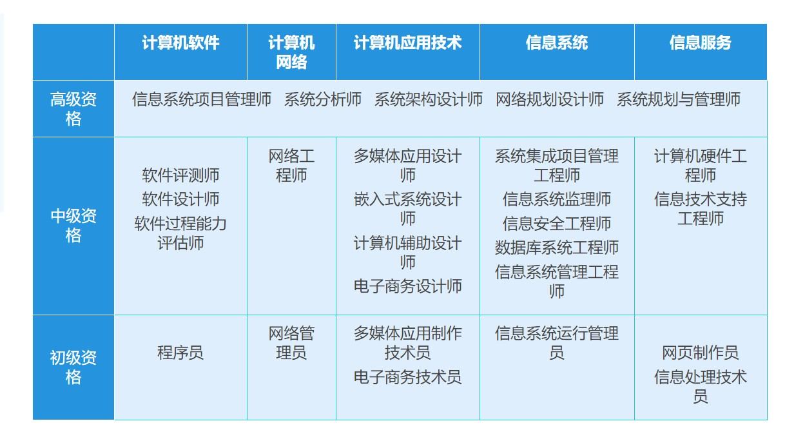

# 前言

* 有关软考证书的一些用途，可以参考评论区，或者站内搜索 V2ex、知乎等有关回答
  * [问问大家关于软考的一些事](https://www.v2ex.com/t/757729)
  * [程序员哪些证书值得去考?](https://v2ex.com/t/827486)

# 信息安全工程师[软考]  

* 证书价值  

评中级职称。  
提高薪酬和升职机会。  
未来信息安全人才将是稀缺和抢手的人才。  
学习信息安全基础理论知识。  

## 考试内容

信息安全工程师考试考试科目共有二门：

基础知识，上午考试，考试时间为150分钟，笔试，75道选择题，总分75分，45分及格；
应用技术，下午考试，考试时间为150分钟，笔试，问答题，一般为4道题目，总分75分，45分及格；

## 资料

* [信息系统安全工程师_2021海滨](https://www.alipan.com/t/hIqLKhZGwoXMCKUpOuVc)

## 刷题

* [软考达人](https://ruankaodaren.com/)

* [历年真题含答案与解析](https://ebook.qicoder.com/%E4%BF%A1%E6%81%AF%E5%AE%89%E5%85%A8%E5%B7%A5%E7%A8%8B%E5%B8%88/)

## 支持我们

我们致力于持续改进和维护这个开源项目，并免费提供给所有人。如果你觉得这个项目对你有所帮助，欢迎通过以下方式支持我们。你的捐赠将帮助我们持续开发和维护这个项目。非常感谢你的支持！

